<p align="center">
  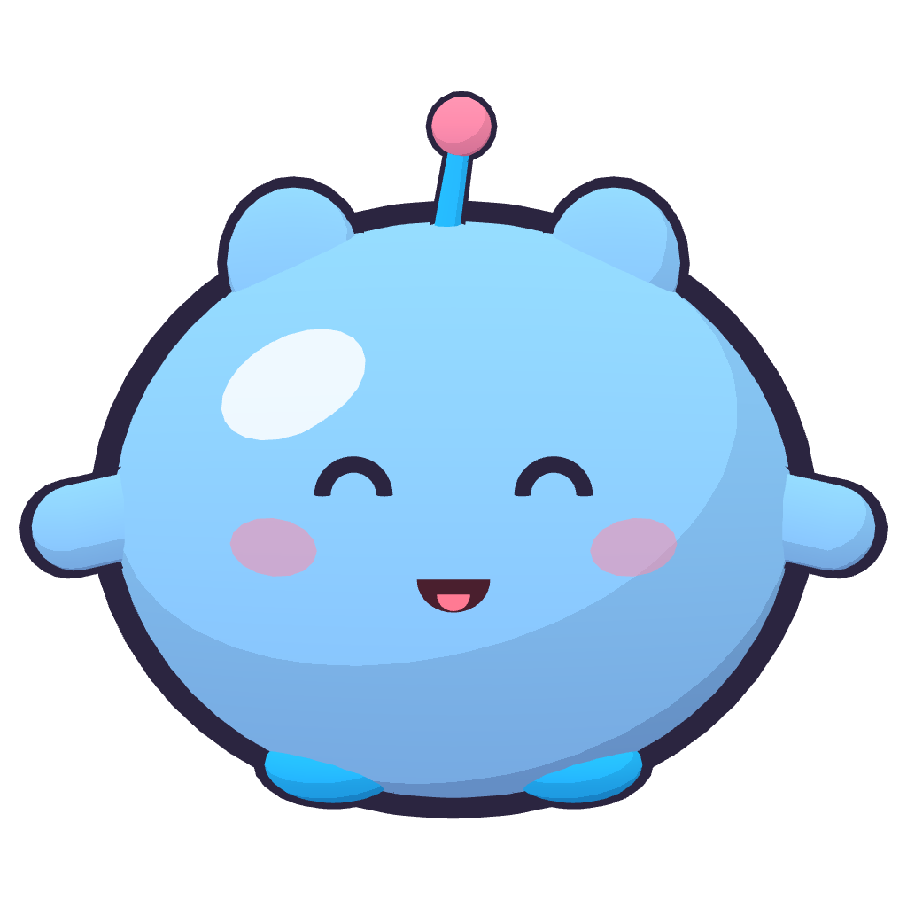
</p>

<h1 align="center">PetAI</h1>

<p align="center">
  Desktop pet lucu bergaya doodle yang tinggal di layar Windows-mu — bisa diklik, diseret, diajak ngobrol,<br>
  dan mengomentari apa yang sedang kamu kerjakan memakai AI milikmu sendiri (BYOK).
</p>

<p align="center">
  Dibuat oleh <a href="https://maulanar.my.id"><b>Maulana Rahman</b></a> · <a href="https://maulanar.my.id">maulanar.my.id</a>
</p>

<p align="center">
  <a href="https://github.com/MaulanaR/petai/releases/latest"><b>⬇️ Unduh rilis terbaru</b></a>
</p>

<p align="center">
  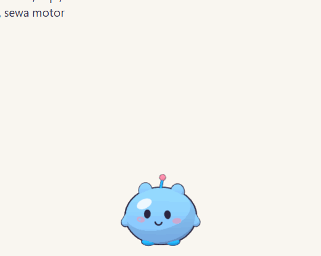
</p>

| Karakter & animasi | Klik · elus · seret |
|---|---|
| 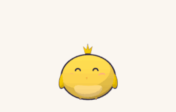 | 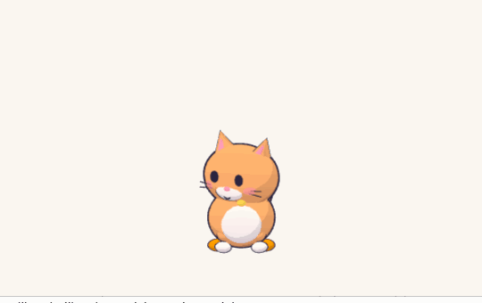 |
| **"Mochi, joget dong!"** — gerakan dirancang AI | **Aktivitas acak:** mules → toilet 🚽 |
| 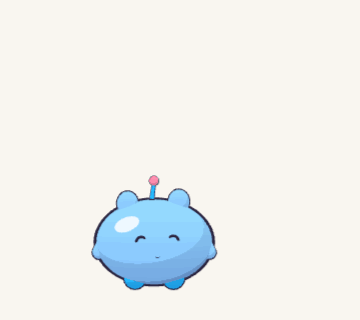 | 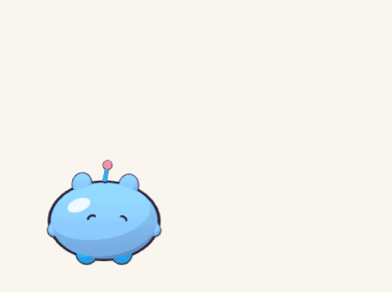 |

---

## Daftar isi

- [Fitur](#fitur)
- [Instalasi](#instalasi)
- [Mulai cepat (5 menit)](#mulai-cepat-5-menit)
- [Cara berinteraksi](#cara-berinteraksi)
- [Aktivitas & perintah gerakan](#aktivitas--perintah-gerakan)
- [Mode gerak](#mode-gerak)
- [Menghubungkan AI (BYOK)](#menghubungkan-ai-byok)
- [Kapan pet berkomentar](#kapan-pet-berkomentar)
- [Privasi & data](#privasi--data)
- [Memori & animasi buatan AI](#memori--animasi-buatan-ai)
- [Pengaturan](#pengaturan)
- [Pemecahan masalah](#pemecahan-masalah)
- [Untuk developer](#untuk-developer)

## Fitur

- **Tanpa jendela aplikasi** — pet hidup di overlay transparan di atas semua jendela. Area di luar pet
  tembus klik, jadi kamu tetap bisa bekerja seperti biasa. Tidak muncul di taskbar; akses lewat ikon tray.
- **3 karakter** — 🫧 Blob Jeli, 🐱 Kucing, 🐥 Anak Ayam. Nama, warna, kepribadian, ukuran bisa diubah.
- **3 mode gerak** — 📍 diam di satu tempat · 🚶 jalan-jalan di atas taskbar & nangkring di atas jendela ·
  🎈 melayang bebas.
- **Interaktif** — klik, klik ganda untuk chat, seret & lempar, elus, menu klik kanan.
- **AI milikmu sendiri** — Anthropic (Claude) atau OpenAI / endpoint kompatibel OpenAI. Key tersimpan aman
  di Windows Credential Manager.
- **Peka aktivitas (opsional)** — pet bisa melihat aplikasi & judul jendela yang aktif lalu memberi
  komentar dan saran yang relevan; bisa juga screenshot ke model vision (izin terpisah).
- **Ingat kebiasaanmu** — memori lokal (kebiasaan, preferensi, tujuan) yang bisa kamu lihat & hapus.
- **Bisa disuruh** — "joget dong", "salto", "push up"… Kalau gerakannya belum ada, AI merancangnya
  (JSON keyframe, bukan kode), divalidasi, disimpan lokal, lalu dipakai ulang tanpa generate ulang.
- **Hidup sendiri** — sesekali main ⚽ bola, 🏀 basket, ⛳ golf, atau tiba-tiba mules lalu muncul 🚽 toilet
  dan dia masuk ke dalamnya. Juga bisa dipanggil lewat menu atau chat ("main bola yuk!").
- **Sopan** — sembunyi otomatis saat game/presentasi/fullscreen, tidak pernah mencuri fokus keyboard,
  jumlah komentar per jam bisa diatur (0 = hanya saat diajak ngobrol).

## Instalasi

Butuh **Windows 10/11 64-bit**. Unduh dari [Releases](https://github.com/MaulanaR/petai/releases/latest):

| File | Keterangan |
|---|---|
| `PetAI-<versi>-windows-amd64-setup.exe` | **Disarankan.** Installer + shortcut Start Menu + uninstaller. Memasang WebView2 Runtime bila belum ada. |
| `PetAI-<versi>-windows-amd64-portable.exe` | Tanpa instal — simpan di folder mana saja lalu jalankan. |

> Aplikasi belum ditandatangani. Jika muncul **"Windows protected your PC"**, klik **More info → Run anyway**.

## Mulai cepat (5 menit)

1. **Jalankan PetAI.** Pet jatuh dari atas lalu mendarat di atas taskbar. Ikon 🫧 muncul di system tray.
2. **Buka Pengaturan** — klik kanan pet → ⚙️ *Pengaturan*, atau klik ikon tray → *Pengaturan…*
3. **Tab 🧠 AI** — pilih provider, tempel API key, klik **Simpan**, lalu **Tes koneksi** dan pilih model.
4. **(Opsional) Tab 🔒 Privasi** — nyalakan *Izinkan pet melihat aktivitas PC* agar pet bisa berkomentar
   tentang apa yang sedang kamu buka.
5. **Klik ganda pet** (atau `Ctrl+Alt+P`) lalu sapa dia. Selesai! 🎉

<p align="center">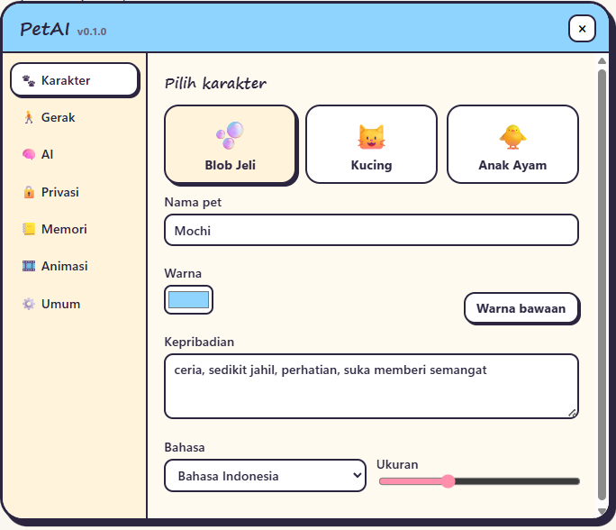</p>

## Cara berinteraksi

| Aksi | Hasil |
|---|---|
| **Klik** pet | Reaksi lucu (lompat, kaget, melambai); kadang menyeletuk |
| **Klik ganda** pet | Buka chat. Ketik lalu **Enter**; **Esc** untuk menutup |
| **Seret** pet | Pet terangkat & menggantung; lepas → jatuh (mode jalan) atau pindah posisi (mode diam/melayang). Bisa dilempar! |
| **Gosok kursor** di atas pet | Dielus → mata hati & ❤️ |
| **Klik kanan** pet | Menu cepat: chat, tidur/bangun, mode gerak, **main ⚽🏀⛳🚽**, ganti karakter, pengaturan, sembunyikan 1 jam, keluar |
| **Ikon tray** | Tampilkan/sembunyikan, chat, pengaturan, *Pause pengamatan*, sembunyikan 1 jam, keluar |
| **`Ctrl+Alt+P`** | Buka chat dari mana saja |

Pet juga punya kehidupan sendiri: berkedip, menatap kursor, jalan-jalan, duduk, dan **tidur** saat kamu
tidak menyentuh PC lebih dari 5 menit — lalu bangun menyapa saat kamu kembali.

## Aktivitas & perintah gerakan

| ⚽ Sepak bola | 🏀 Basket |
|---|---|
| 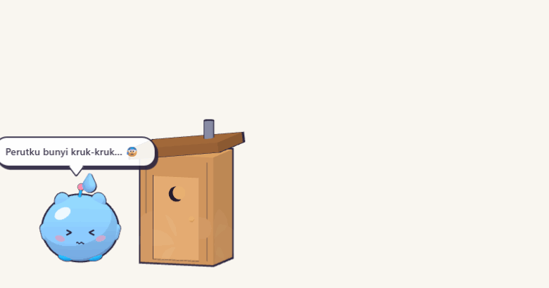 | 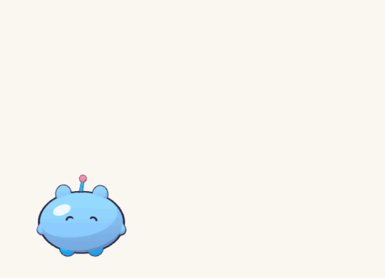 |
| **⛳ Golf** | **🚽 Toilet** |
| 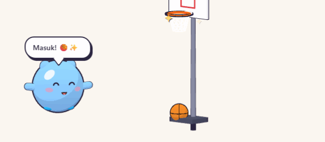 |  |

**Aktivitas** — adegan mini dengan properti 3D yang muncul lalu hilang:

| Aktivitas | Yang terjadi |
|---|---|
| ⚽ Sepak bola | Bola jatuh memantul, pet mengejar & menendang beberapa kali, tendangan akhir → "GOOOL!" |
| 🏀 Basket | Ring muncul, pet dribel lalu menembak — kadang meleset dan mencoba lagi → "Swish~" |
| ⛳ Golf | Pet memegang stik, bendera muncul di kejauhan, pukulan → hampir masuk → putt → "Masuk lubang!" (kadang *hole in one*) |
| 🚽 Toilet | Ekspresi mules (> <, keringat) → toilet kayu muncul → pet masuk, pintu tertutup, asap bau mengepul → keluar lega ✨ |

Cara memicunya:
- **Otomatis** — sesekali saat pet sedang santai, kira-kira tiap 3–8 menit (makin tinggi *Seberapa aktif
  berkeliaran*, makin sering).
- **Klik kanan pet → Main** → pilih ⚽ 🏀 ⛳ 🚽.
- **Lewat chat** — "main bola yuk", "coba main golf", "kamu kebelet ya?" (butuh AI).

Menyeret/menekan pet di tengah aktivitas akan menghentikannya. Di mode *Diam*, pet kembali berjalan ke
tempatnya setelah selesai; di mode *Melayang*, ia turun dulu ke lantai.

**Perintah gerakan lewat chat** — minta apa saja: "joget dong", "salto ke belakang", "push up", "muter-muter".
- Kalau gerakannya sudah ada di pustaka, pet langsung melakukannya.
- Kalau belum, AI merancang gerakan baru (bubble menampilkan *🎵 lagi latihan gerakan baru…*), lalu pet
  langsung memperagakannya. Lama merancang tergantung model (umumnya 10–60 detik), **cukup sekali** —
  gerakan tersimpan di *Pengaturan → 🎞️ Animasi* dan berikutnya langsung dipakai.

## Mode gerak

| Mode | Perilaku |
|---|---|
| 📍 **Diam** | Tetap di satu tempat, hanya animasi di tempat. Seret untuk memindah — posisi diingat. |
| 🚶 **Jalan** | Berjalan di atas taskbar, sesekali melompat & **nangkring di tepi atas jendela aktif**; jatuh kalau jendelanya dipindah/diminimize. |
| 🎈 **Melayang** | Terbang pelan ke mana saja di layar, tanpa gravitasi. |

Ganti lewat klik kanan pet → *Gerak*, atau *Pengaturan → 🚶 Gerak* (kecepatan & seberapa aktif berkeliaran).

## Menghubungkan AI (BYOK)

Biaya API ditanggung akunmu sendiri; PetAI tidak punya server. Key disimpan di **Windows Credential
Manager** (bukan di file) dan tidak pernah dikirim ke tempat lain selain provider yang kamu pilih.

| Provider | Isian di *Pengaturan → 🧠 AI* |
|---|---|
| **Anthropic (Claude)** | Provider *Anthropic*, key `sk-ant-…`, model mis. `claude-opus-5-5` (terpintar), `claude-sonnet-5-5`, `claude-haiku-4-5` (terhemat) |
| **OpenAI** | Provider *OpenAI*, key `sk-…`, klik *Tes koneksi*, pilih model |
| **Kompatibel OpenAI** (OpenRouter, Ollama, LM Studio, gateway lain) | Provider *OpenAI*, buka *Lanjutan* → isi **Base URL** (mis. `https://openrouter.ai/api/v1`, `http://localhost:11434/v1`) |

Tips hemat: pakai model kecil untuk obrolan sehari-hari dan turunkan slider **"Seberapa cerewet"**
(0 = pet hanya bicara saat diajak). Model harus mendukung *structured output / JSON schema*.

Cek koneksi tanpa membuka pet (butuh Go): `go run ./cmd/petai-check -provider openai -model <model> -base <url>`
— menampilkan daftar model, balasan chat, dan contoh komentar atas jendela yang sedang aktif.

## Kapan pet berkomentar

| Momen | Contoh |
|---|---|
| Baru dibuka / kamu kembali setelah ≥10 menit | Sapaan |
| Pindah ke aplikasi baru ±2 menit* | "Lagi nyusun catatan liburan, ya? …" + 💡 saran |
| ±50 menit di aplikasi yang sama* | Ajakan istirahat sejenak |
| Larut malam (23.00–04.00) | Pengingat tidur |
| Sesekali acak | Celetukan lucu |
| Screenshot berkala* (izin terpisah) | Komentar berdasarkan isi layar |

\* hanya jika *Izinkan pet melihat aktivitas* dinyalakan. Semua komentar otomatis dibatasi
**maks N per jam** (default 12, jeda minimal 3 menit) dan berhenti saat ada aplikasi fullscreen.

## Privasi & data

<p align="center">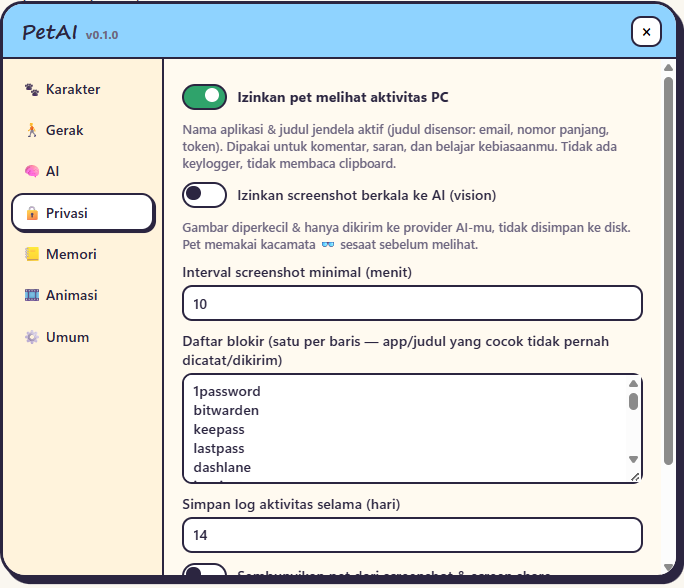</p>

- **Default: tidak mengamati apa pun.** Pengamatan aktivitas dan screenshot harus kamu nyalakan sendiri.
- **Yang dikirim ke AI** (bila diizinkan): nama exe aplikasi aktif + judul jendela yang **disensor**
  (email, nomor ≥6 digit, token/API key, query URL, nama user di path `C:\Users\…`).
- **Tidak pernah**: keylogger, isi clipboard, isi file, screenshot ke disk.
- **Daftar blokir** — aplikasi/judul yang cocok (password manager, perbankan, chat, incognito, prompt
  kredensial Windows, …) tidak pernah dicatat maupun dikirim. Bisa kamu tambah sendiri.
- **Screenshot** (opsional): diperkecil, hanya dikirim saat momen screenshot, pet memakai 👓 sesaat sebelumnya.
  Pet sendiri disembunyikan dari screenshot & screen share.
- **Pause pengamatan** kapan saja dari ikon tray.
- **Lokasi data**: `%APPDATA%\PetAI\` — `config.json`, `petai.db` (log aktivitas, memori, chat),
  `animations\`, `logs\`. Log aktivitas otomatis dihapus setelah N hari (default 14).
  *Pengaturan → Privasi → Hapus semua data pribadi* menghapus log aktivitas, memori, dan riwayat chat.

## Memori & animasi buatan AI

- **Memori** (*Pengaturan → 📒 Memori*): hal yang pet pelajari tentangmu dari obrolan & pola pemakaian
  (mis. jam mulai kerja, aplikasi favorit). Bisa diedit, dihapus, ditambah manual, atau *Lupakan semua*.
  Sehari sekali pet merangkum kebiasaan dari statistik lokal.
- **Animasi** (*Pengaturan → 🎞️ Animasi*): 19 gerakan bawaan + gerakan buatan AI. Klik ▶ untuk
  memutar, ⧉ untuk menyalin JSON, 🗑 untuk menghapus, atau impor JSON gerakan buatanmu sendiri.
  Format gerakan didokumentasikan di [`qa/CONTRACT.md`](qa/CONTRACT.md#animationspec-dsl).

## Pengaturan

| Tab | Isi |
|---|---|
| 🐾 Karakter | Pilih karakter, nama, warna, kepribadian, bahasa (Indonesia/English), ukuran |
| 🚶 Gerak | Mode gerak, kecepatan, seberapa aktif, kembalikan posisi |
| 🧠 AI | Aktif/nonaktif, provider, API key, model, base URL, tes koneksi, batas komentar per jam |
| 🔒 Privasi | Izin melihat aktivitas, screenshot & intervalnya, daftar blokir, retensi log, sembunyi dari screen share, hapus data |
| 📒 Memori | Daftar memori + ringkasan pemakaian 7 hari |
| 🎞️ Animasi | Pustaka gerakan, putar/ekspor/hapus/impor |
| ⚙️ Umum | Jalan saat Windows mulai, sembunyi saat fullscreen, FPS, monitor, log debug, buka folder data |

## Pemecahan masalah

| Masalah | Solusi |
|---|---|
| Pet tidak terlihat | Klik ikon tray → *Tampilkan pet*. Saat ada aplikasi fullscreen pet memang sembunyi. Coba *Pengaturan → Gerak → Kembalikan posisi pet*. |
| Chat tidak dibalas | *Pengaturan → AI → Tes koneksi*. Pastikan AI aktif, key tersimpan, model dipilih, dan model mendukung JSON schema. Lihat `%APPDATA%\PetAI\logs\petai.log`. |
| Pet tidak pernah berkomentar sendiri | Nyalakan *Izinkan pet melihat aktivitas*, pastikan slider "cerewet" > 0, dan tunggu ±2 menit di sebuah aplikasi. Aplikasi di daftar blokir sengaja diabaikan. |
| Tidak bisa mengetik di chat | Klik ganda pet sekali lagi; ketik setelah kotak input menyala biru. |
| Ingin PetAI jalan otomatis | *Pengaturan → Umum → Jalankan saat Windows mulai*. |
| Ingin menghapus key | *Pengaturan → AI → Hapus*, atau Windows *Credential Manager* → entri `PetAI:anthropic` / `PetAI:openai`. |
| Keluar | Ikon tray → *Keluar* (Alt+F4 sengaja dinonaktifkan agar pet tidak tertutup tak sengaja). |

## Untuk developer

**Stack:** Go 1.26+ · [Wails v2](https://wails.io) · vanilla JS · [three.js](https://threejs.org) ·
SQLite (`modernc.org/sqlite`, tanpa CGO) · `anthropic-sdk-go` · `openai-go v3`.

```bash
powershell -ExecutionPolicy Bypass -File scripts/build.ps1          # build\bin\petai.exe
powershell -ExecutionPolicy Bypass -File scripts/build.ps1 -Installer  # + installer NSIS (butuh makensis)
powershell -ExecutionPolicy Bypass -File scripts/dev.ps1            # wails dev (hot reload)
npm --prefix frontend run dev                                       # lalu buka /preview.html: preview karakter tanpa Wails
go test ./internal/... ./cmd/...                                    # package main butuh frontend/dist hasil build
```

Skrip memakai `go run github.com/wailsapp/wails/v2/cmd/wails@v2.16.0` (Wails CLI v2.9.x gagal membuat
bindings di Go 1.26+).

**Rilis:** push tag `vX.Y.Z` → GitHub Actions ([`.github/workflows/release.yml`](.github/workflows/release.yml))
membangun exe portable + installer, lalu membuat GitHub Release otomatis dengan catatan dari
[`docs/RELEASE_NOTES.md`](docs/RELEASE_NOTES.md).

```
main.go, app.go            Wails app + method yang dipanggil frontend
cmd/petai-check            Cek koneksi AI dari command line
internal/overlay           Win32: overlay transparan, click-through dinamis, fokus, DPI
internal/watcher           Jendela aktif, idle, DND/fullscreen, screenshot, sensor & blocklist
internal/brain             Kapan pet bicara, prompt, structured output, animasi & memori
internal/ai                Provider Anthropic & OpenAI(-compatible)
internal/anim              DSL animasi, validasi, pustaka lokal + 19 animasi bawaan
internal/store             SQLite: aktivitas, memori, chat
internal/config, secrets   config.json & Windows Credential Manager
internal/tray, sys         Ikon tray, autostart, hotkey
internal/debugapi          API QA lokal (hanya aktif bila PETAI_DEBUG_ADDR diset)
frontend/src               three.js: karakter, player DSL, behavior, aktivitas + properti, bubble, menu, pengaturan
qa/                        Kontrak uji + harness QA (mock AI, skrip PowerShell)
```

Variabel lingkungan untuk pengujian (`PETAI_DATA_DIR`, `PETAI_DEBUG_ADDR`, `PETAI_FAST`, override base URL
& key) didokumentasikan di [`qa/CONTRACT.md`](qa/CONTRACT.md).

## Pencipta

**PetAI** diciptakan oleh **Maulana Rahman** — 🌐 [maulanar.my.id](https://maulanar.my.id) ·
🐙 [@MaulanaR](https://github.com/MaulanaR)

© 2026 Maulana Rahman. Jika kamu memakai atau mengembangkan PetAI, mohon cantumkan kredit ke pencipta.
